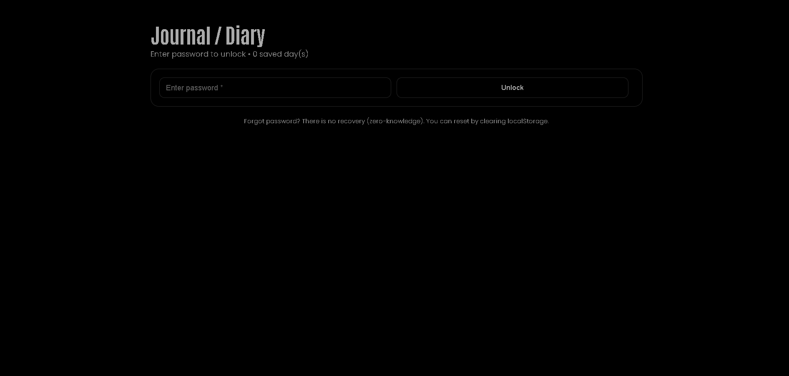
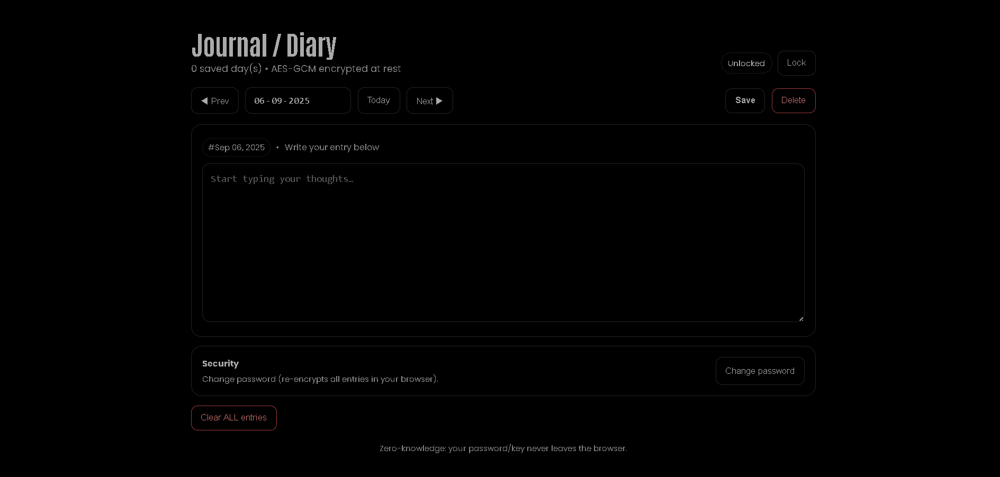
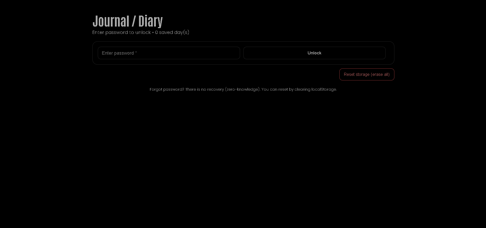

# Personal Journal / Diary (React + styled-components, AES-GCM)





**Live Demo:** https://a2rp.github.io/journal/

A lightweight, frontend-only journal with **password protection**. Entries are **AES-GCM encrypted** in your browser using a key derived from your password (PBKDF2). Transparent UI that blends with a black/dark theme.

## Features

-   Create, edit, delete **daily entries**
-   **Password lock/unlock** (no recovery)
-   **Client-side encryption** (AES-GCM, PBKDF2)
-   Change password (re-encrypts all entries locally)
-   Clear **ALL** entries (with confirm)
-   LocalStorage persistence
-   Custom confirm modal (no portals)
-   Dark/black theme friendly (no background overrides)

## Security (quick notes)

-   Your password is **never stored**; the derived key lives only in memory when unlocked.
-   Data at rest is encrypted in LocalStorage; clearing the browser/storage will remove it.
-   There is **no password recovery**. Keep your password safe.

## Local Install

```bash
# 1) Clone the repo
git clone https://github.com/a2rp/journal.git
cd journal

# 2) Install dependencies
npm i

# 3) Run dev server
npm run dev
```
