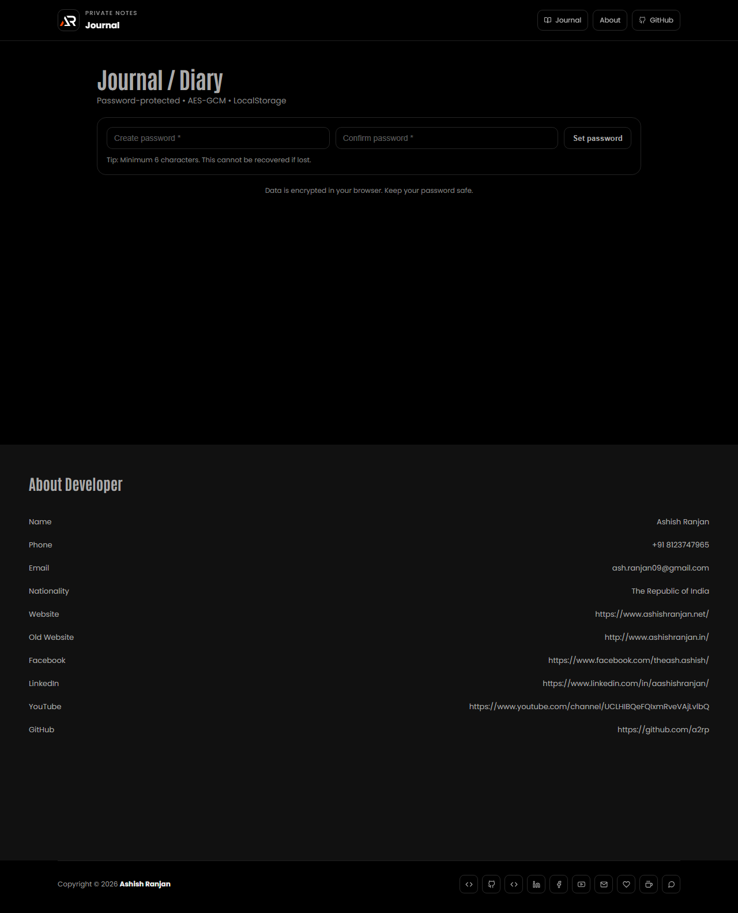

# Private Journal

A frontend-only journal built with React and styled-components. Entries are protected by a password and encrypted in the browser with AES-GCM before they are stored in LocalStorage.

## Features

- Create, edit, delete, and browse daily entries
- Password setup, unlock, lock, and password change flow
- Browser-side AES-GCM encryption with PBKDF2 key derivation
- LocalStorage persistence with clear-all and reset controls
- Responsive fixed header, icon-only footer links, and go-to-top button

## Tech stack

React, Vite, styled-components, Web Crypto API, and LocalStorage.

## Run locally

```bash
npm install
npm run dev
```

Build and deploy:

```bash
npm run lint
npm run build
npm run deploy
```

## Screenshot



## Security note

The password is not stored and there is no recovery flow. Clearing browser storage removes the local journal data.

## Links

- Live: [https://a2rp.github.io/journal/](https://a2rp.github.io/journal/)
- Repository: [https://github.com/a2rp/journal](https://github.com/a2rp/journal)
- Portfolio: [https://www.ashishranjan.net/](https://www.ashishranjan.net/)
- GitHub: [https://github.com/a2rp](https://github.com/a2rp)
- CodePen: [https://codepen.io/ash1198](https://codepen.io/ash1198)
- LinkedIn: [https://www.linkedin.com/in/aashishranjan](https://www.linkedin.com/in/aashishranjan)
- Facebook: [https://www.facebook.com/theash.ashish/](https://www.facebook.com/theash.ashish/)
- YouTube: [https://www.youtube.com/@ashishranjan-ashz?sub_confirmation=1](https://www.youtube.com/@ashishranjan-ashz?sub_confirmation=1)
- Email: [ash.ranjan09@gmail.com](mailto:ash.ranjan09@gmail.com)

## Support

- Support: [https://a2rp-donation-page.netlify.app/](https://a2rp-donation-page.netlify.app/)
- Buy Me a Coffee: [https://buymeacoffee.com/a2rp](https://buymeacoffee.com/a2rp)
- Patreon: [https://www.patreon.com/a2rp](https://www.patreon.com/a2rp)
