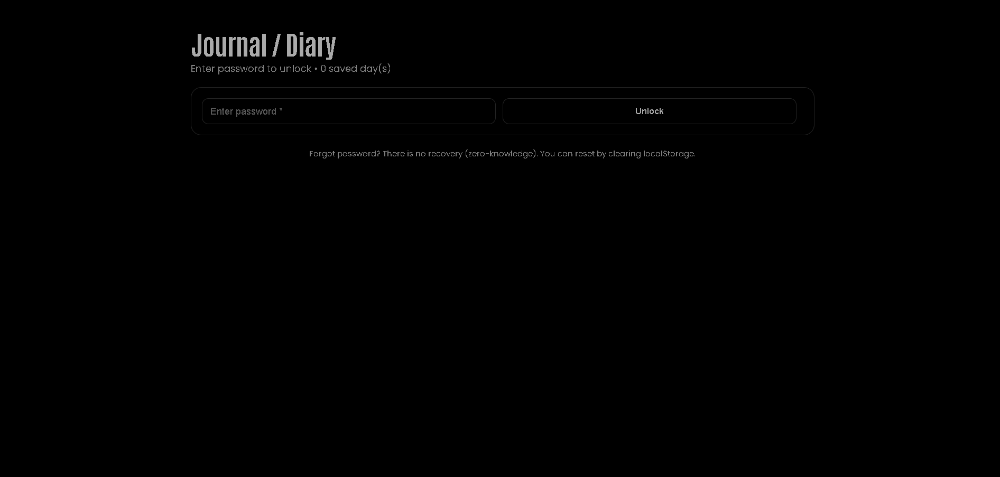
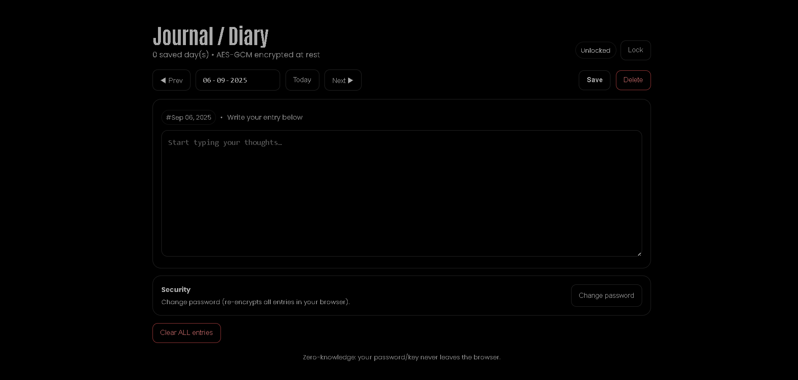
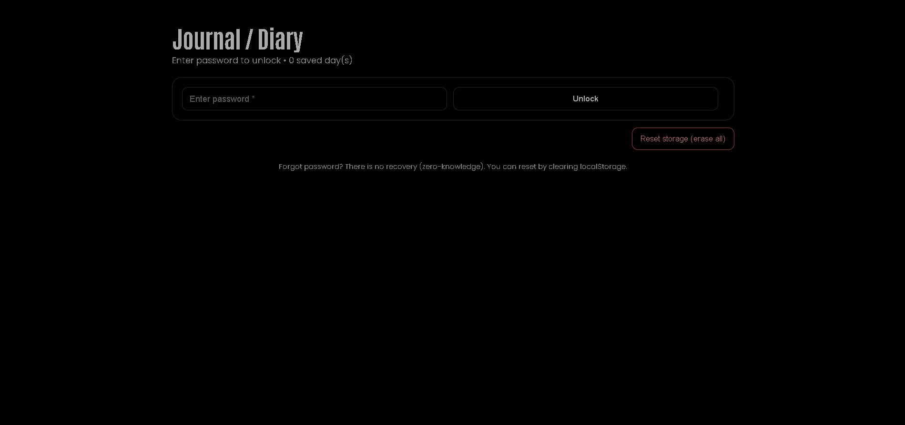

# Personal Journal / Diary (React + styled-components, AES-GCM)





**Live Demo:** https://a2rp.github.io/journal/

A lightweight, frontend-only journal with **password protection**. Entries are **AES-GCM encrypted** in your browser using a key derived from your password (PBKDF2). Transparent UI that blends with a black/dark theme.

## Features

-   Create, edit, delete **daily entries**
-   **Password lock/unlock** (no recovery)
-   **Client-side encryption** (AES-GCM, PBKDF2)
-   Change password (re-encrypts all entries locally)
-   Clear **ALL** entries (with confirm)
-   LocalStorage persistence
-   Custom confirm modal (no portals)
-   Dark/black theme friendly (no background overrides)

## Security (quick notes)

-   Your password is **never stored**; the derived key lives only in memory when unlocked.
-   Data at rest is encrypted in LocalStorage; clearing the browser/storage will remove it.
-   There is **no password recovery**. Keep your password safe.

## Local Install

```bash
# 1) Clone the repo
git clone https://github.com/a2rp/journal.git
cd journal

# 2) Install dependencies
npm i

# 3) Run dev server
npm run dev
```

## Links

- Portfolio: [https://www.ashishranjan.net](https://www.ashishranjan.net)
- GitHub: [https://github.com/a2rp](https://github.com/a2rp)
- CodePen: [https://codepen.io/ash1198](https://codepen.io/ash1198)
- LinkedIn: [https://www.linkedin.com/in/aashishranjan](https://www.linkedin.com/in/aashishranjan)
- Facebook: [https://www.facebook.com/theash.ashish/](https://www.facebook.com/theash.ashish/)
- YouTube: [https://www.youtube.com/@ashishranjan-ashz?sub_confirmation=1](https://www.youtube.com/@ashishranjan-ashz?sub_confirmation=1)
- Email: [ash.ranjan09@gmail.com](mailto:ash.ranjan09@gmail.com)

## Support

- Support: [https://a2rp-donation-page.netlify.app/](https://a2rp-donation-page.netlify.app/)
- Buy Me A Coffee: [https://buymeacoffee.com/a2rp](https://buymeacoffee.com/a2rp)
- Patreon: [https://patreon.com/a2rp](https://patreon.com/a2rp)
<!-- Project links -->

## Links

- Live: [https://a2rp.github.io/journal/](https://a2rp.github.io/journal/)
- Repository: [https://github.com/a2rp/journal](https://github.com/a2rp/journal)
- Portfolio: [https://www.ashishranjan.net/](https://www.ashishranjan.net/)
- GitHub: [https://github.com/a2rp](https://github.com/a2rp)
- CodePen: [https://codepen.io/ash1198](https://codepen.io/ash1198)
- LinkedIn: [https://www.linkedin.com/in/aashishranjan](https://www.linkedin.com/in/aashishranjan)
- Facebook: [https://www.facebook.com/theash.ashish/](https://www.facebook.com/theash.ashish/)
- YouTube: [https://www.youtube.com/@ashishranjan-ashz?sub_confirmation=1](https://www.youtube.com/@ashishranjan-ashz?sub_confirmation=1)
- Email: [ash.ranjan09@gmail.com](mailto:ash.ranjan09@gmail.com)

## Support

- Support: [https://a2rp-donation-page.netlify.app/](https://a2rp-donation-page.netlify.app/)
- Buy Me a Coffee: [https://buymeacoffee.com/a2rp](https://buymeacoffee.com/a2rp)
- Patreon: [https://www.patreon.com/a2rp](https://www.patreon.com/a2rp)
